# Practica-Docker-Compose
#José Noel Coratavarria, Manel Esteve, Sergio Otero
Para realizar este ejercicio nos hemos visto obligados a descargar un proyecto ya realizado y hacerlo con ese. Aún así ha sido bastante complicado llegar a completar el trabajo.

Para realizar la siguiente actividad se necesita el programa de Docker Desktop (viene instalado con docker y docker-compose, ambos los necesitamos) y un proyecto completo.

Empezamos llevando la terminal hacia la carpeta en la que se ubica el proyecto

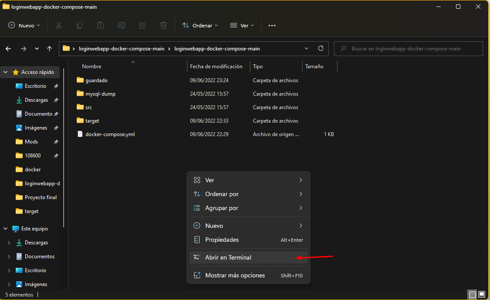

Una vez abierta la terminal hay que asegurarse de abrir docker desktop, simplemente hay que iniciarlo

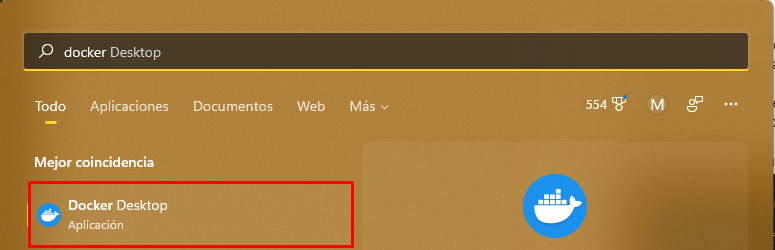

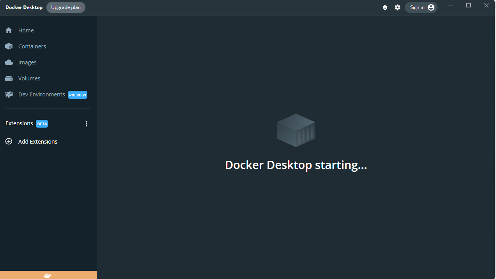Una vez abierto hay que esperar a que se acabe de iniciar docker

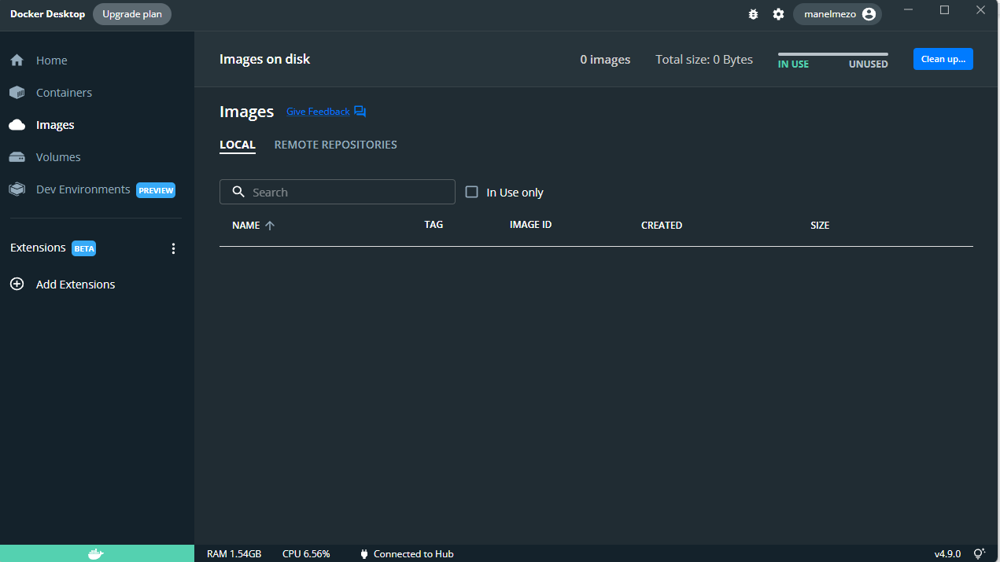Nosotros tenemos el docker completamente vacío para realizar el programa y ver lo que ocurre paso por paso.

En el terminal escribimos el siguiente comando docker-compose up -d  (la -d no es obligatorio, pero al realizarlo se inicia en segundo plano, permitiéndonos seguir utilizando la terminal

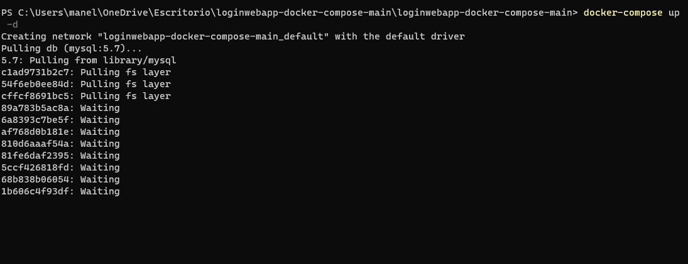Una vez realizado el comando, solo falta esperar

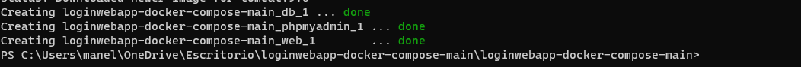

Como podemos observar, la terminal nos indica que los tres procesos se han iniciado sin ningún problema. Procedemos a comprobarlo.

En la barra de navegación hay que poner localhost:(numero delimitado/nombre carpeta) de la siguiente manera  El número a poner lo podemos ver en el docker-compose.yml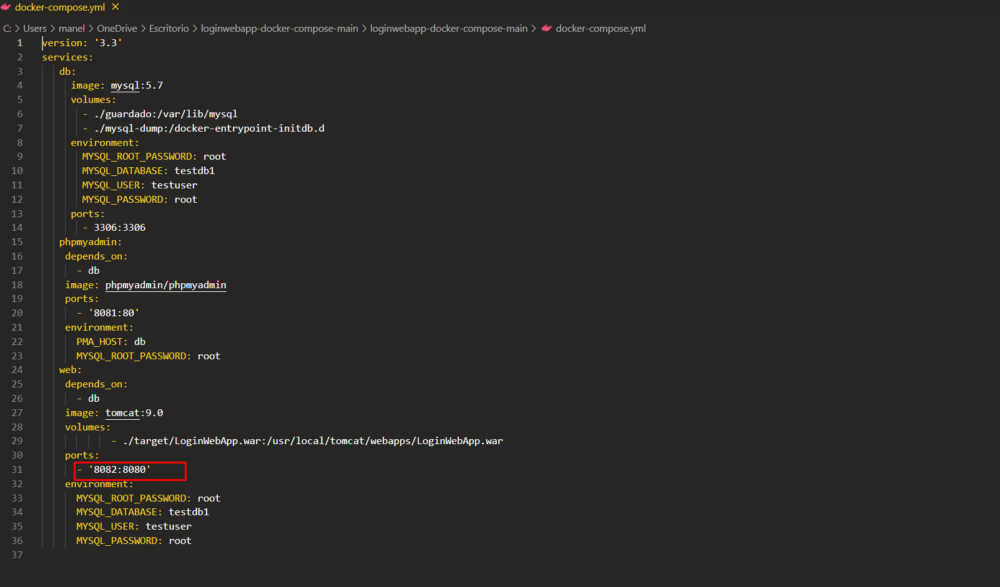

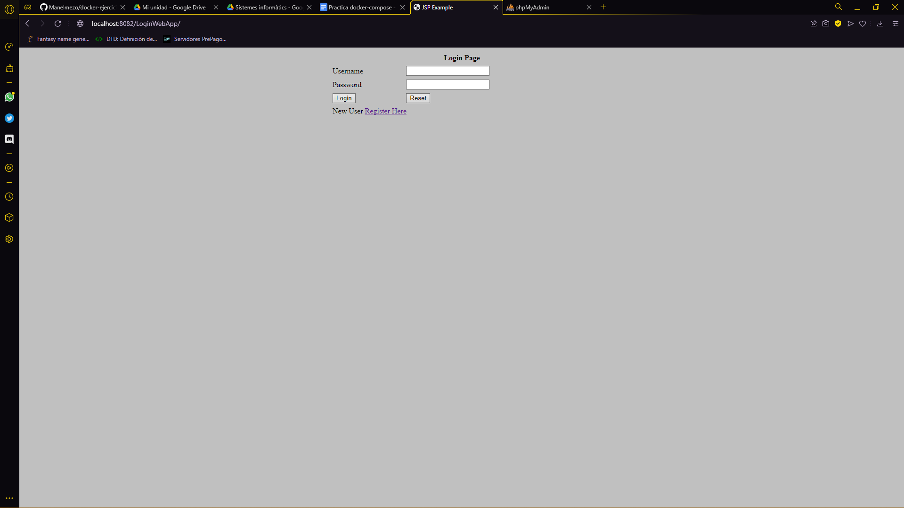

El 8082 es el de la página web, pero si ponemos 8081

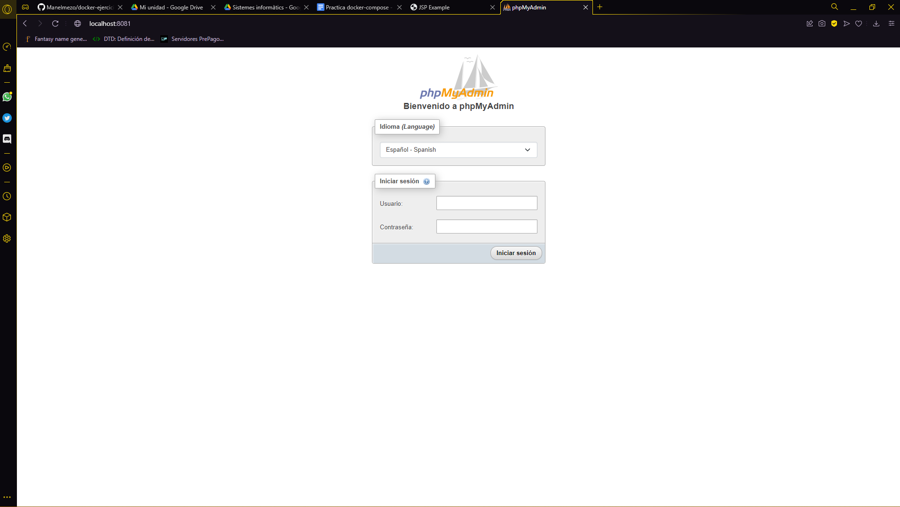Sale el phpMyAdmin.

Vamos a iniciar sesión en el phpMyAdmin con la contraseña y el usuario delimitado también en el docker-compose.yml

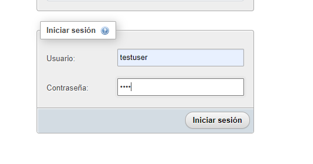

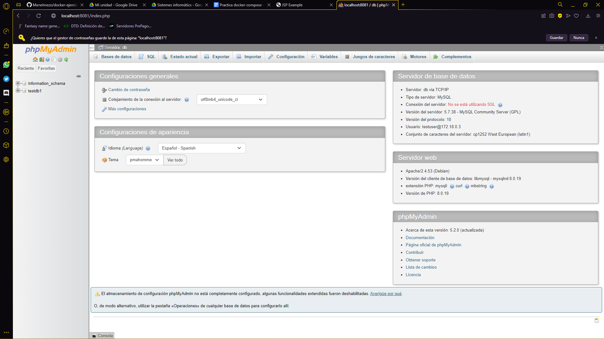

Podemos comprobar que la base de datos se ha formado correctamente.

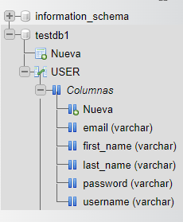

Ahora aquí viene el único error que hemos encontrado y hemos sido incapaces de arreglar.

Mientras que la base de datos está en perfecto funcionamiento, al intentar registrarse desde la página web, sale el siguiente error.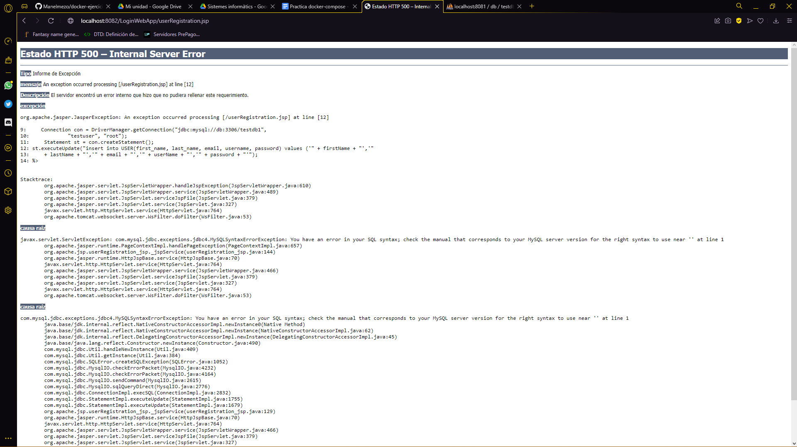

Hemos intentado solucionarlos tocando tanto la base de datos, como las clases en sí y no lo hemos logrado. Excluyendo ese error, todo lo demás se visualiza correctamente sin ningún problema.

Ahora para finalizar le diremos a docker que termine el proceso con un docker-compose down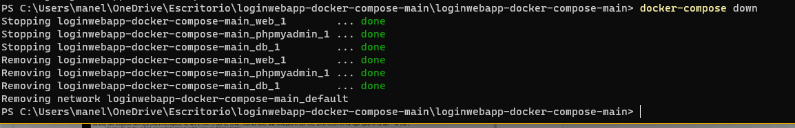

Y de nuevo no salta ningún error

En conclusión, esta actividad realmente se puede realizar con un solo comando, la dificultad principal ha venido de la falta de conocimientos de docker y su correcto funcionamiento y del problema con la base de datos que hemos sido incapaces de resolver. También nos ha resultado imposible subir el proyecto a github y a dockerhub, al intentar subirlo a GitHub dice que algunos archivos no se pueden subir, y ahí lo deja.
